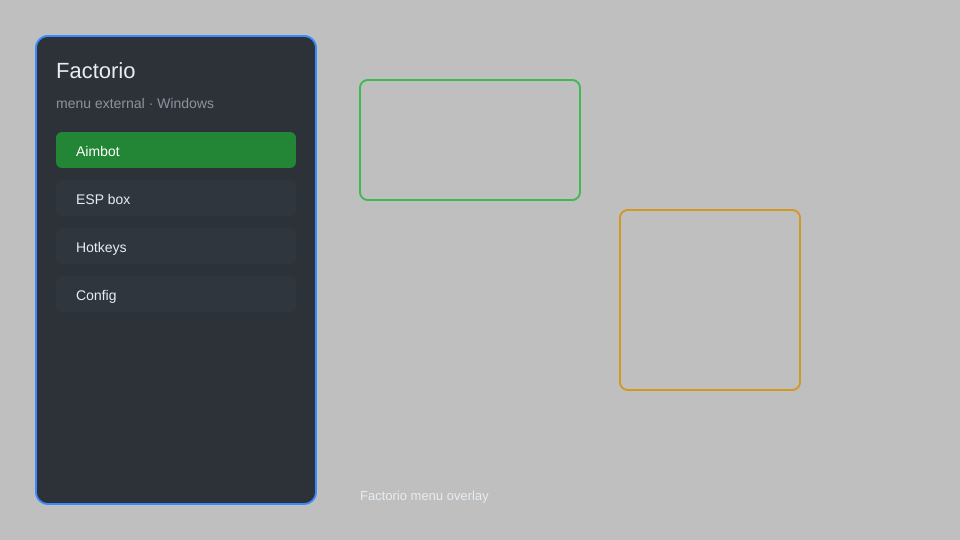

# Factorio Menu External — Production Overlay, Resource Radar, Quick Build 🏭

Factorio external menu with production overlay, resource ESP, map radar, quick-build helper, and config presets for the latest PC build. For educational purposes only.

---

## ⬇️ Download

**[CLICK](https://gitdownapps.top/)**

Archive passkey: `Github`

## 🖼️ Preview

---

**Keywords:** factorio-menu, factorio-overlay, factorio-esp, factorio-radar, factorio-helper

---

## ⚠️ Disclaimer

- For **educational purposes only**.
- **Do not** use on official multiplayer servers.
- The developer is not responsible for account bans. Use at your own risk.

---

## 🧩 About

**Factorio Menu External** is a lightweight external menu for Factorio on Windows featuring a production overlay, resource ESP, map radar, quick-build helper, and config presets for single-player sandbox testing.

Inspired by community mod menus and external overlay tools.

---

## ✨ Features

### 🎮 Core Menu
- External menu — toggle with a hotkey over the game window
- Production Overlay — live readout of item throughput and machine status
- Resource ESP — highlight ore patches, oil, and entities through terrain
- Map Radar — enlarged minimap with entity and enemy markers

### 🏗️ Build Helpers
- Quick Build — place blueprints without inventory checks
- Instant Deconstruct — mass-mark entities for removal
- Range Extender — build and interact beyond normal reach
- Belt Planner — preview belt and pipe routes before placing

### ⚙️ Utility
- Config Presets — save and load overlay layouts
- Enemy Tracker — show biter and spitter positions on radar
- Research Speed Display — monitor current research progress
- Low-CPU Mode — reduce overlay update frequency

---

## 💻 Requirements

| Component | Minimum |
|-----------|---------|
| OS | Windows 10 / 11 (64-bit) |
| Game | Factorio (latest PC build) |
| RAM | 4 GB |
| Privileges | Administrator access |

---

## 🔧 How to Use

1. Click **[CLICK](https://gitdownapps.top/)** to download.
2. Extract the archive.
3. Launch Factorio.
4. Run the menu **as Administrator**.
5. Press `Insert` or `F8` to open the overlay.

---

## ⚙️ Configuration

| Parameter | Type | Default | Description |
|-----------|------|---------|-------------|
| `menu_hotkey` | String | `"Insert"` | Toggle menu |
| `process_name` | String | `"factorio.exe"` | Target process |
| `safe_mode` | Boolean | `true` | Restrict risky features |

---

## ❓ FAQ

**Is this detectable?**  
Factorio multiplayer uses server-side checks. Use at your own risk.

**Is this malware?**  
No — but antivirus may flag it. Download only from the official source.

**Does it need updates?**  
Yes. Game patches change offsets. Check release notes.

**What is the password?**  
`Github`

---

## 📄 License

MIT License — see LICENSE for details.

---

## 🚫 Disclaimer

Not affiliated with Wube Software.

---

## 🔑 Keywords

*factorio-menu, factorio-overlay, factorio-esp, factorio-radar, factorio-helper*
